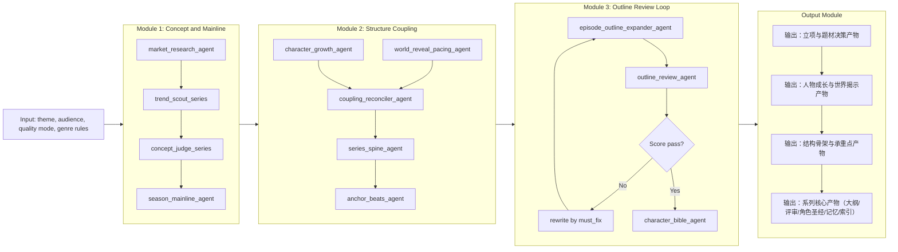
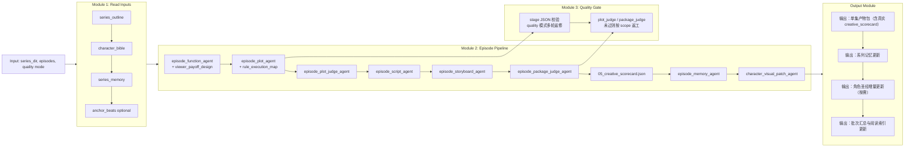

# ai-shortdrama-agent（短剧长篇生产工作流）

`ai-shortdrama-agent` 是一个面向短剧/微短剧创作的结构化生产引擎，提供从系列立项到分集生成的标准化流水线，输出可追踪、可复用、可二次开发的 JSON 资产。

## 产品能力概览

1. `series-setup`：完成系列级资产生产（主线、角色成长、世界揭示、结构骨架、大纲与评审）
2. `episode-batch`：完成分集级资产生产（功能卡、节拍、剧本、分镜）并持续更新全局记忆与角色圣经

所有生成结果都会落在仓库内的：

`ai_manga_factory/runs/`

**新版目录结构（`series-setup` 今后默认）**：按层级文件夹 + 文件名序号，一眼可读顺序：


| 层级  | 文件夹                       | 主要内容（示例文件名）                                                                                                                                                                               |
| --- | ------------------------- | ----------------------------------------------------------------------------------------------------------------------------------------------------------------------------------------- |
| L0  | `L0_setup/`               | `01_series_setup.json`、`02_episode_pitch.json`                                                                                                                                            |
| L1  | `L1_season/`              | `01_season_mainline.json`、`02_character_growth.json`、`03_world_reveal_pacing.json`                                                                                                        |
| L2  | `L2_spine/`               | `01_coupling_map.json`、`02_series_spine.json`、`03_anchor_beats.json`                                                                                                                      |
| L3  | `L3_series/`              | `01_series_outline.json`、`01b_outline_review.json`、`02_character_bible.json`、`03_series_memory.json`、`04_episode_batch.json`、`05_series_manifest.json`（**阅读导航**：`reading_order`、依赖、单集流水线） |
| L4  | `L4_episodes/<剧名>_第NNN集/` | `01_episode_function.json` → `06_package.json`（序号即阅读顺序）                                                                                                                                   |


## 部署与环境准备

### 1）Python

建议使用 Python 3.10+。

### 2）依赖

项目代码使用了以下包（按需安装即可）：

- `google-adk`（ADK Runner/Agent/Session）
- `google-genai`（模型调用）
- `python-dotenv`（加载 `.env`）

示例（可按你实际环境调整版本）：

```bash
pip install google-adk google-genai python-dotenv
```

### 2.5）创建并激活虚拟环境（推荐）

Windows PowerShell：

```powershell
cd "d:\AI_Agent\ai-shortdrama-agent-adk"
python -m venv .venv
.\.venv\Scripts\Activate.ps1
pip install -U pip
pip install google-adk google-genai python-dotenv
```

macOS / Linux：

```bash
cd /path/to/ai-shortdrama-agent-adk
python3 -m venv .venv
source .venv/bin/activate
pip install -U pip
pip install google-adk google-genai python-dotenv
```

## 关键源码依赖（必须存在）

`run_series.py` 会依赖仓库中的：

- `ai_manga_factory/agent.py`（提供 `root_agent`、语言策略等）
- `ai_manga_factory/__init__.py`（确保包导入正常）

如果你采用“只推指定文件”的策略到远端，请确保部署环境里这些文件也能被访问到（否则命令会导入失败）。

### 3）API Key（必须）

在 `ai_manga_factory/.env` 放置你的密钥，至少包含：

- `GOOGLE_API_KEY`（Gemini/VertexAI 使用）
- `GOOGLE_GENAI_USE_VERTEXAI`（可选，按你环境配置）

注意：密钥与生产数据（如 `runs/`）不要提交到 Git。

## 运行方式（CLI）

入口脚本：

- `python -m ai_manga_factory.run_series`

### 1）series-setup（生成系列资产）

示例：

```powershell
cd "d:\AI_Agent\ai-shortdrama-agent-adk"

python -m ai_manga_factory.run_series --mode series-setup `
  --theme "系统+求生+规则验证" `
  --audience-view "青年男性，节奏快、爽点密集" `
  --quality-mode fast
```

`quality` 模式（开启更严格质检与返修重试）：

```powershell
python -m ai_manga_factory.run_series --mode series-setup `
  --theme "系统+求生+规则验证" `
  --audience-view "青年男性，节奏快、爽点密集" `
  --quality-mode quality
```

执行完成后，在 `ai_manga_factory/runs/<剧名>/` 查看系列级输出资产。

### 2）episode-batch（生成分集资产并持续更新）

示例（生成第 1-3 集）：

```powershell
python -m ai_manga_factory.run_series --mode episode-batch `
  --series-dir "d:\AI_Agent\ai-shortdrama-agent-adk\ai_manga_factory\runs\<剧名>" `
  --episodes "1-3" `
  --quality-mode quality
```

运行过程中会把每集产物写入：

- `ai_manga_factory/runs/<剧名>/episodes/<剧名>_第XXX集/`

并把更新后的 memory / bible / batch 回写到对应路径（新版在 `L3_series/`，旧版在根目录）：

- `.../L3_series/03_series_memory.json` 或 `.../series_memory.json`

## 总体工作流（多集闭环）

流程由系列资产层与分集资产层构成，并通过 `series_memory` 进行跨集状态同步，确保连续创作与稳定迭代。

### 流程图（GitHub 友好：横向分模块 + 模块内纵向递进）

#### A. `series-setup`（输入来源 / 评审闭环 / 输出文件）




#### B. `episode-batch`（输入来源 / 质量门控 / 输出文件）




### 1）series-setup（生成系列基础材料）

`run_series.py --mode series-setup` 会按顺序调用（均要求输出结构化 JSON）：

1. `market_research_agent`：生成市场与创作方向 `market_report`
2. `trend_scout_series`：生成 3 个长篇系列概念候选
3. `concept_judge_series`：评审并推荐 1 个概念
4. `season_mainline_agent`：先定义整季主线（只给方向，不给分集细节）
5. `character_growth_agent`：定义人物成长路径（人物成长主导）
6. `world_reveal_pacing_agent`：定义世界观揭示节奏
7. `coupling_reconciler_agent`：对齐“人物成长线”与“世界揭示线”的双向因果链
8. `series_spine_agent`：产出全作骨架（延迟细化，不写具体分集）
9. `anchor_beats_agent`：锁定关键承重点（数量动态，不固定）
10. `episode_outline_expander_agent`：从 spine + anchors 展开成 `series_outline`
11. `outline_review_agent`：对大纲按题材匹配/市场吸引力/转折节奏/篇幅承载力等维度打分；低分会触发重写
12. `character_bible_agent`：生成 `character_bible.json`（含 `face_triptych_prompt_cn` 与 `body_triptych_prompt_cn`，均 <= 800）

> `outline_review_agent` 闭环规则（当前默认）：
>
> - `quality` 模式：大纲最低分阈值为 8，最多重写 3 轮
> - `fast` 模式：大纲最低分阈值为 7，最多重写 2 轮

series-setup 输出固定落盘到（**相对路径**均在 `runs/<剧名>/` 下；以下为新版分层目录）：

- `L0_setup/01_series_setup.json`
- `L1_season/01_season_mainline.json`
- `L1_season/02_character_growth.json`
- `L1_season/03_world_reveal_pacing.json`
- `L2_spine/01_coupling_map.json`
- `L2_spine/02_series_spine.json`
- `L2_spine/03_anchor_beats.json`
- `L3_series/01_series_outline.json`
- `L3_series/01b_outline_review.json`
- `L3_series/02_character_bible.json`
- `L0_setup/02_episode_pitch.json`（新版）；旧版为 `episode_pitch.json`
- `L3_series/03_series_memory.json`（初始为空）
- `L3_series/04_episode_batch.json`（episodes 为空）
- `L3_series/05_series_manifest.json`（阅读顺序与依赖说明；旧版为根目录 `series_manifest.json`）

### 2）episode-batch（按集生成并更新 series_memory）

`run_series.py --mode episode-batch` 只需要你提供 `--series-dir` 和 `--episodes`。
脚本会从 `--series-dir` 自动读取（**新版**在 `L3_series/`、`L2_spine/` 等；**旧版**在剧根目录，自动兼容）：

- `01_series_outline.json` 或 `series_outline.json`
- `02_character_bible.json` 或 `character_bible.json`
- `03_series_memory.json` 或 `series_memory.json`
- `03_anchor_beats.json`（`L2_spine/`）或 `anchor_beats.json`（若存在，则供 `episode_function_agent` 关联 `linked_anchor_ids`；旧目录无此文件时为空对象）

然后对每个 `episode_id` 依次执行：

1. `episode_function_agent`：生成本集功能卡（含 **`viewer_payoff_design`**：本集必须给观众的爽点/兑现设计，与 `must_advance` 等同级）
2. `episode_plot_agent`：在功能卡约束下生成本集节拍 plot，并对齐 `series_memory.open_threads`；同时输出 **`rule_execution_map`**（本集规则与 beat 的触发—反馈绑定，剧情逻辑层）
3. **`episode_plot_judge_agent`（可选）**：审 plot 逻辑、爽点是否落地、规则是否可执行；不通过则带反馈重写 plot（轮次由 `--judge-retries` 控制）
4. `episode_script_agent`：生成口语化 script（须落实 `viewer_payoff_design` 与 `rule_execution_map`）
5. `episode_storyboard_agent`：生成 Seedance 分镜（输入含 **plot**，确保规则与爽点在可拍层落地）
6. **`episode_package_judge_agent`（可选）**：在 **memory 之前**审整包（功能卡兑现、叙事是否空、Seedance prompt 是否可用）；结果写入 **`05_creative_scorecard.json`**（替代占位）；不通过则按 `rewrite_scope` 返工：`storyboard` / `script` / `plot`
7. `episode_memory_agent`：更新并落盘 `series_memory`
8. `character_visual_patch_agent`（按需）：对新登场且尚未在圣经中的角色补全肖像条目并写回 `character_bible.json`

> **分集 judge 何时启用**：`--quality-mode quality` 时默认开启；`fast` 模式下默认关闭以省调用，可加 **`--episode-judge`** 强制开启。可用 **`--no-episode-judge`** 在 quality 下关闭。 **`--judge-retries`** 控制 plot 侧与 package 侧各自最多重试次数（默认 2）。

> 说明：新角色在本集仍是「先 script/storyboard、后 package 评审与 memory、再补 bible」；**下一集**起 pipeline 会读到更新后的 `character_bible.json`。
>
> `quality` 模式下，`episode_function/plot/script/storyboard/memory/char_visual_patch` 会启用阶段 JSON 校验，不通过会自动带反馈重试（最多 3 轮）。

`episode_function` 建议字段结构（节选）：

```json
{
  "episode_id": 1,
  "linked_anchor_ids": [1, 3],
  "episode_goal_in_series": "string",
  "must_advance": ["string"],
  "must_inherit": ["string"],
  "viewer_payoff_design": [
    {
      "type": "rule_exploit",
      "setup_source": "must_inherit",
      "payoff_target": "act2_or_act3",
      "description": "主角须在本集内利用一次规则，而非只被动挨打"
    }
  ],
  "what_changes_persistently": ["string"],
  "future_threads_strengthened": ["string"]
}
```

`plot` 中建议增加 `rule_execution_map`（与 `acts` 同级），示例：

```json
"rule_execution_map": [
  {
    "rule_id": "R1",
    "rule_text": "晚十点后，请勿直视窗外",
    "rule_layer": "surface",
    "trigger_beat": "act1_beat_5",
    "feedback": "违反后无声痉挛，口鼻渗血",
    "verified_in_episode": true
  }
]
```

每集最终写入到：

- 新版：`L4_episodes/<剧名>_第XXX集/01_episode_function.json` … `06_package.json`
- 旧版：`episodes/<剧名>_第XXX集/episode_function.json` … `package.json`

同时持续刷新：

- `L3_series/03_series_memory.json`（或旧版根目录同名文件）
- `L3_series/02_character_bible.json`（有新角色时追加条目；或旧版根目录）
- `L3_series/04_episode_batch.json`（或旧版根目录）
- `L3_series/05_series_manifest.json`（每次 batch 结束重写；或旧版根目录 `series_manifest.json`）

### 题材规则注入（genres）

在调用各 agent 之前，会基于上下文文本推断 `genre_key`，
并从 `genres/genre_reference.json` 抽取对应的 `rules_block` 注入提示词，
确保禁忌、节奏、语言铁律等在多步骤生成里一致生效。

### 设计原则（架构动机）

- 先拆开定义 `整季主线/人物成长/世界揭示`，避免一个 agent 早期过度细化。
- 用 `coupling_reconciler_agent` 强制对齐双向因果：  
世界观变化 -> 事件压力 -> 人物改变；  
人物改变 -> 决策变化 -> 推动下一次世界揭示。
- `series_spine + anchor_beats` 先锁承重结构，再让分集展开，减少“55 集看起来热闹但空心”的风险。

## 数据结构约定（简表）

### `series_memory.json`

结构：

```json
{
  "episodes": [
    { "episode_id": 3, "summary": "...", "open_threads": ["..."] }
  ],
  "characters": [
    { "name": "李岩", "first_episode": 3, "last_appeared_episode": 3, "status": "alive", "appearance_hint": "..." }
  ]
}
```

说明：

- `characters` 只包含“有名字的角色”，`群众/观众` 不入该表。
- `episodes.open_threads` 用于跨集回扣与悬念延续。

## 仓库与交付约束

建议你始终遵守：

- 不提交 `ai_manga_factory/.env`
- 不提交 `ai_manga_factory/runs/`（生产输出）
- 不提交 `.venv/`

如果你要工业化部署（CI/CD 或多人协作），推荐补一个 `.gitignore` 来强制忽略上述目录/文件。