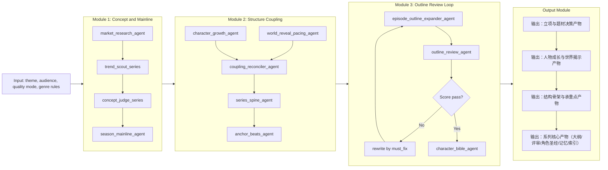
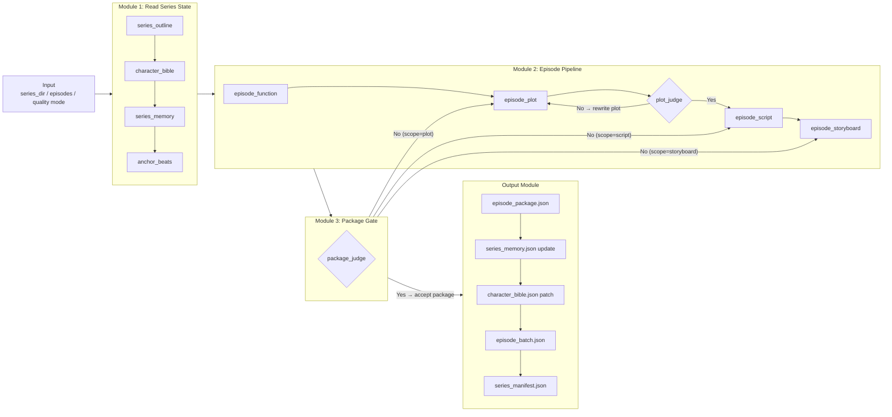

# ai-shortdrama-agent

**短剧 / 微短剧长篇结构化生产引擎** — 用固定流水线把「立项 → 大纲 → 分集剧本与分镜」打成**可版本管理、可对接后期与视频工具**的 JSON 资产，并用 **`series_memory` 跨集对齐状态**，降低长剧创作里常见的**断层、吃设定、爽点落空**问题。

适合：内容团队做**季播规划**、制片方要**可审计物料**、个人作者需要**从大纲一路生成到 Seedance 友好分镜**的工作流。

---

## 解决什么问题

| 痛点 | 本仓库的做法 |
|------|----------------|
| 写到后面忘了前面 | `series_memory` + 每集 `episode_function` 强制承接线索与锚点 |
| 大纲很炫、单集飘 | 先 **spine / anchor**，再分集；分集前先有「本集在整季的功能卡」 |
| 规则怪谈写成四不像 | `genre_reference.json` 注入 **题材规则 + capabilities**（如是否强制 `rule_execution_map`） |
| 产出散乱难对接 | **L0–L4 分层目录 + 序号文件名**；`05_series_manifest.json` 给阅读顺序与依赖 |
| 质量不可控 | `quality` 模式：**阶段 JSON 质检** + 可选 **plot / package 双层 Judge**（见下文流程图） |

---

## 核心能力一览

- **两阶段 CLI**：`series-setup`（系列资产）→ `episode-batch`（按集生成并回写记忆）
- **多专职 Agent 流水线**：市场与概念 → 主线与人物成长 → 世界揭示与耦合 → 大纲与**大纲评审闭环** → 角色圣经（含 Seedance 肖像提示词约束）
- **分集管线**：功能卡（含观众爽点设计）→ 节拍 plot（条件化 `rule_execution_map`）→ 剧本 → 分镜 →（可选）评审 → 记忆更新 → 新角色视觉补丁写回圣经
- **题材感知**：同一套 Agent，通过 **`capabilities` 开关**区分规则怪谈 / 都市 / 情感等，避免非规则题材被硬写成「伪规则剧」
- **输出即协议**：JSON schema 稳定，便于接剪辑、TTS、视频生成（如 Seedance）或内部 CMS

---

## 工作原理（一页读懂）

```
┌─────────────────────────────────────────────────────────────────┐
│  series-setup    生成「整季怎么讲」：主线、成长线、骨架、分集大纲、圣经  │
└────────────────────────────┬────────────────────────────────────┘
                             ▼
┌─────────────────────────────────────────────────────────────────┐
│  episode-batch   按集生成「这一集干什么 + 怎么拍」并更新全局记忆      │
└─────────────────────────────────────────────────────────────────┘
```

| 模块 | 职责 |
|------|------|
| **系列层** | 立项与市场判断 → 概念评审 → 季内结构（spine / anchors）→ 分集大纲 → 大纲打分与返修 → 角色圣经 |
| **分集层** | 本集功能卡与爽点 → 节拍与（按需）规则绑定表 → 剧本 → 分镜 → 可选整包评审 → `series_memory` 落盘 |
| **跨集记忆** | `series_memory` 汇总分集摘要、线索、角色状态；下一集自动读入，减少幻觉与吃书 |

更细的 Agent 顺序与**评审回路**，见下方 **流程图**。

---

## 快速开始

### 环境要求

- Python **3.10+**
- 依赖：`google-adk`、`google-genai`、`python-dotenv`

### 1）安装依赖（推荐虚拟环境）

**Windows PowerShell**

```powershell
cd "d:\AI_Agent\ai-shortdrama-agent-adk"
python -m venv .venv
.\.venv\Scripts\Activate.ps1
pip install -U pip
pip install google-adk google-genai python-dotenv
```

**macOS / Linux**

```bash
cd /path/to/ai-shortdrama-agent-adk
python3 -m venv .venv
source .venv/bin/activate
pip install -U pip
pip install google-adk google-genai python-dotenv
```

### 2）配置 API Key

在 **`ai_manga_factory/.env`** 中配置（**切勿提交到 Git**）：

- `GOOGLE_API_KEY`（必填）
- `GOOGLE_GENAI_USE_VERTEXAI`（可选，视你的接入方式）

### 3）跑通一条最小链路

**① 系列立项（生成整季资产）**

```powershell
cd "d:\AI_Agent\ai-shortdrama-agent-adk"

python -m ai_manga_factory.run_series --mode series-setup `
  --theme "系统+求生+规则验证" `
  --audience-view "青年男性，节奏快、爽点密集" `
  --quality-mode fast
```

**② 分集批量（在 `runs/<剧名>/` 下执行）**

```powershell
python -m ai_manga_factory.run_series --mode episode-batch `
  --series-dir "d:\AI_Agent\ai-shortdrama-agent-adk\ai_manga_factory\runs\<剧名>" `
  --episodes "1-3" `
  --quality-mode quality
```

- **`fast`**：省调用，分集 Judge 默认关闭（可加 `--episode-judge` 打开）。
- **`quality`**：更严 JSON 质检 + 默认开启 **plot / package Judge**（可用 `--no-episode-judge` 关闭）；`--judge-retries` 控制重试轮次。

**入口统一为**：`python -m ai_manga_factory.run_series`

---

## 输出落在哪里

所有生成物默认在：

`ai_manga_factory/runs/<剧名>/`

**新版分层目录（`series-setup` 默认）** — 文件夹 + 序号文件名，方便交付与 diff：

| 层级 | 文件夹 | 主要内容（示例） |
|------|--------|------------------|
| **L0** | `L0_setup/` | `01_series_setup.json`、`02_episode_pitch.json` |
| **L1** | `L1_season/` | 整季主线、人物成长、世界揭示节奏 |
| **L2** | `L2_spine/` | 耦合图、系列骨架、承重锚点 |
| **L3** | `L3_series/` | 分集大纲、大纲评审、角色圣经、`series_memory`、`episode_batch`、**`05_series_manifest.json`（阅读导航）** |
| **L4** | `L4_episodes/<剧名>_第NNN集/` | `01_episode_function.json` … `06_package.json` |

---

## 关键源码依赖

`python -m ai_manga_factory.run_series` 至少需要同包内：

- `run_series.py`（入口）
- `series_agents.py`、`genre_rules.py`、`creative_constants.py`（模型与中文策略、JSON 兜底）
- `genres/`（如 `genre_reference.json`）
- `__init__.py`

仅拷贝部分文件到服务器时，请带上以上文件与目录，否则导入会失败。

---

## 总体工作流与流程图

系列资产与分集资产通过 **`series_memory`** 形成闭环：每一集结束更新记忆，下一集读取，保证**跨集连续创作**可迭代。

下列流程图与上文「工作原理」一致，便于对外评审或 onboarding：**A = 系列立项**，**B = 分集生产（含 Judge 合格 / 不合格分支示意）**。

### A. `series-setup`（输入 / 评审闭环 / 输出）



### B. `episode-batch`（分集流水线 + 门控）



> **Judge 说明**：`quality` 默认开启；`fast` 可加 `--episode-judge`；`--no-episode-judge` 可关闭。详细合格/不合格路径与 `rewrite_scope` 见下文「分集阶段说明」。

---

## 系列阶段说明（`series-setup`）

`run_series.py --mode series-setup` 按顺序调用各 Agent（均输出结构化 JSON），典型顺序：

1. 市场调研 → 2. 三个系列概念 → 3. 概念评审 → 4. 整季主线 → 5. 人物成长 → 6. 世界揭示节奏 → 7. 人物线/世界线耦合 → 8. 系列骨架 → 9. 承重锚点 → 10. 展开分集大纲 → 11. **大纲评审**（未过则带 `must_fix` 重写）→ 12. 角色圣经

**大纲评审默认阈值**

- `quality`：最低分 **8**，最多 **3** 轮重写  
- `fast`：最低分 **7**，最多 **2** 轮重写  

**主要落盘文件**（相对 `runs/<剧名>/`，新版路径）：

- `L0_setup/`、`L1_season/`、`L2_spine/`、`L3_series/` 下各 JSON（含 `01_series_outline.json`、`01b_outline_review.json`、`02_character_bible.json`、`03_series_memory.json` 初始空、`04_episode_batch.json`、`05_series_manifest.json`）

---

## 分集阶段说明（`episode-batch`）

提供 `--series-dir` 与 `--episodes`（如 `1-3` 或 `1,5,7`）。脚本自动读取大纲、圣经、记忆与锚点（**新版**在 `L3_series/`、`L2_spine/`；**旧版平铺**仍兼容）。

每集典型顺序：

1. **功能卡**（含 `viewer_payoff_design`）  
2. **plot**（含 `rule_execution_map`；非规则题材可由 `capabilities` 允许空数组）  
3. **plot_judge**（可选）→ 不通过重写 plot  
4. **script** → 5. **storyboard**  
6. **package_judge**（可选）→ 结果写入 **`05_creative_scorecard.json`**；不通过按 `rewrite_scope` 返工  
7. **memory** 更新 → 8. **新角色**按需写入 `character_bible`  

`quality` 下对 function / plot / script / storyboard / memory 等做 **JSON 结构质检**，失败带反馈最多重试 **3** 轮。

### 字段示例（节选）

`episode_function` 中的观众爽点设计：

```json
{
  "episode_id": 1,
  "viewer_payoff_design": [
    {
      "type": "rule_exploit",
      "setup_source": "must_inherit",
      "payoff_target": "act2_or_act3",
      "description": "主角须在本集内利用一次规则，而非只被动挨打"
    }
  ]
}
```

`plot` 中 `rule_execution_map`（**规则怪谈等题材**由 capabilities 强制；都市/情感等可为 `[]`）：

```json
"rule_execution_map": [
  {
    "rule_id": "R1",
    "rule_text": "晚十点后，请勿直视窗外",
    "rule_layer": "surface",
    "trigger_beat": "act1_beat_5",
    "feedback": "违反后无声痉挛，口鼻渗血",
    "verified_in_episode": true
  }
]
```

**单集目录**：新版 `L4_episodes/<剧名>_第XXX集/01_…06_package.json`；旧版 `episodes/…`。

---

## 题材规则（genres）

调用前会根据上下文推断 `genre_key`，从 `genres/genre_reference.json` 注入 **`rules_block` + `capabilities`**（如 `requires_rule_execution_map`、`uses_explicit_rules` 等），保证**禁忌、节奏、铁律**与**是否强制规则绑定表**在全流水线一致。

---

## 设计原则（为何这样拆）

- **先季内结构、后分集细节**，避免一上来就写散集。  
- **耦合器**对齐「世界侧变化 ↔ 人物侧变化」双向因果。  
- **spine + anchors** 先锁承重，再展开分集，降低「集数多但空心」风险。  

---

## 数据结构简表：`series_memory.json`

```json
{
  "episodes": [
    { "episode_id": 3, "summary": "...", "open_threads": ["..."] }
  ],
  "characters": [
    { "name": "李岩", "first_episode": 3, "last_appeared_episode": 3, "status": "alive", "appearance_hint": "..." }
  ]
}
```

- `characters` 仅收录**具名角色**；群众/观众不进表。  
- `open_threads` 用于跨集回扣与悬念延续。  

---

## 生产状态层（MVP+）

除 `series_memory` 外，仓库已接通 **production carry 状态层**（`03b_production_carry_registry.json`）与可控 op：

- `promise_lane`：承诺跟踪（`open/paid_off/broken/stale`），支持跨集同一性、人工 override、轻量 supersede 标记。  
- `relation_pressure_map`：关系压力态势（弱/强证据分流，保守写入）。  
- `knowledge_fence`：最小信息边界轨迹（`fact_id/fact_text/visibility/confidence/known_by`），仅在高置信度场景填 `known_by`。  
- `visual_lock_registry`：角色视觉锁覆盖与补丁。

---

## Gate Artifact 与趋势摘要

分集 gate 结果会落到单集目录：

- 分层：`L4_episodes/<剧名>_第NNN集/07_gate_artifacts.json`
- 平铺：`episodes/<剧名>_第NNN集/gate_artifacts.json`

每次 gate 追加 `entries`，并维护 `trend_summary`，可直接给控制台/后续 dashboard 消费。核心字段包括：

- latest verdict：`latest_plot_gate`、`latest_package_gate`、`latest_overall_pass_state`
- 失败追踪：`failure_signature`、`consecutive_same_failure_count`、`failure_trend_label`
- 编排提示：`rerun_hint`、`latest_verdict.last_suggested_rerun_hint`
- 轻恢复提示：`recovery_light_hint`

---

## Studio Operations（查询与纠偏）

入口：`python -m ai_manga_factory.studio_operations`

常用能力：

- `query.promise_status`：按状态/创建集/anchor/manual/supersede 查询承诺，支持 `--promise-id` 单条详情。  
- `query.knowledge_fence`：按 `audience_only`、`low_confidence`、`known_by_character`、`recent_changes` 等模式过滤。  
- `query.gate_status` / `query.gate_trend`：读取单集 gate 最新结论与趋势尾部。  
- `carry.refresh_slice`：刷新 `promise_lane|relation_pressure_map|knowledge_fence`。  
- `carry.apply_promise_overrides`：人工状态纠偏，保留 `override_reason/override_source/previous_status`。

示例：

```powershell
python -m ai_manga_factory.studio_operations run query.promise_status `
  --series-dir "d:\AI_Agent\ai-shortdrama-agent-adk\ai_manga_factory\runs\<剧名>" `
  --promise-filter manual_only
```

```powershell
python -m ai_manga_factory.studio_operations run query.gate_trend `
  --series-dir "d:\AI_Agent\ai-shortdrama-agent-adk\ai_manga_factory\runs\<剧名>" `
  --episode-id 1
```

```powershell
python -m ai_manga_factory.studio_operations run query.knowledge_fence `
  --series-dir "d:\AI_Agent\ai-shortdrama-agent-adk\ai_manga_factory\runs\<剧名>" `
  --kf-query-mode recent_changes
```

---

## 许可证

本仓库默认使用 **MIT License**（见仓库根目录 [`LICENSE`](LICENSE)）：他人可自由使用、修改与再分发，但需保留版权声明与许可全文；**不提供任何明示或默示担保**。可将 `LICENSE` 中的版权行改为你的真实姓名或组织名，并与实际权利归属一致。
