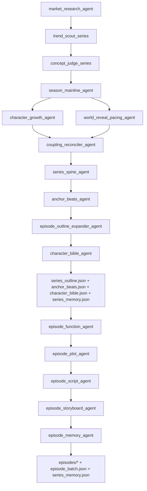

# ai-shortdrama-agent（短剧长篇生成工作流）

这是一个面向“短剧/微短剧”的长篇生成工作流，按固定阶段产出结构化 JSON，并在多集之间通过 `series_memory` 保持连续性。

## 你会得到什么

1. `series-setup`：生成长篇系列的基础材料
2. `episode-batch`：按集先生成 `episode_function`（本集功能卡），再生成 `plot / script / storyboard`，并更新 `series_memory`

所有生成结果都会落在仓库内的：

`ai_manga_factory/runs/`

并且每个剧名目录下包含：

- `series_setup.json`
- `series_outline.json`
- `character_bible.json`
- `episode_pitch.json`
- `series_memory.json`
- `episode_batch.json`

以及每集子目录：

- `episode_function.json`（本集在整季中的功能卡：承接 anchor、必须推进/继承、持久变化等）
- `plot.json`
- `script.json`
- `storyboard.json`
- `creative_scorecard.json`
- `package.json`

## 环境准备

### 1）Python

建议使用 Python 3.10+。

### 2）依赖

项目代码使用了以下包（按需安装即可）：

- `google-adk`（ADK Runner/Agent/Session）
- `google-genai`（模型调用）
- `python-dotenv`（加载 `.env`）

示例（可按你实际环境调整版本）：

```bash
pip install google-adk google-genai python-dotenv
```

## 关键源码依赖（必须存在）

`run_series.py` 会依赖仓库中的：

- `ai_manga_factory/agent.py`（提供 `root_agent`、语言策略等）
- `ai_manga_factory/__init__.py`（确保包导入正常）

如果你采用“只推指定文件”的策略到远端，请确保部署环境里这些文件也能被访问到（否则命令会导入失败）。

### 3）API Key（必须）

在 `ai_manga_factory/.env` 放置你的密钥，至少包含：

- `GOOGLE_API_KEY`（Gemini/VertexAI 使用）
- `GOOGLE_GENAI_USE_VERTEXAI`（可选，按你环境配置）

注意：密钥与生产数据（如 `runs/`）不要提交到 Git。

## 使用方法（CLI）

入口脚本：

- `python -m ai_manga_factory.run_series`

### 1）series-setup（先生成系列大纲/角色/初始 memory）

示例：

```powershell
cd "d:\AI_Agent\ai-shortdrama-agent-adk"

python -m ai_manga_factory.run_series --mode series-setup `
  --theme "系统+求生+规则验证" `
  --audience-view "青年男性，节奏快、爽点密集" `
  --quality-mode fast
```

执行完成后，去 `ai_manga_factory/runs/<剧名>/` 找到上述 JSON 文件。

### 2）episode-batch（逐集生成并持续更新 series_memory）

示例（生成第 1-3 集）：

```powershell
python -m ai_manga_factory.run_series --mode episode-batch `
  --series-dir "d:\AI_Agent\ai-shortdrama-agent-adk\ai_manga_factory\runs\<剧名>" `
  --episodes "1-3"
```

运行过程中会把每集产物写入：

- `ai_manga_factory/runs/<剧名>/episodes/<剧名>_第XXX集/`

并把更新后的 `series_memory.json` 回写到：

- `ai_manga_factory/runs/<剧名>/series_memory.json`

## 总体工作流（多集闭环）

整个流程由两个阶段构成，并由 `series_memory` 把跨集连续性“落盘 + 读取”。

### 流程图（series-setup 到 episode-batch）



### 1）series-setup（生成系列基础材料）

`run_series.py --mode series-setup` 会按顺序调用（均要求输出结构化 JSON）：

1. `market_research_agent`：生成市场与创作方向 `market_report`
2. `trend_scout_series`：生成 3 个长篇系列概念候选
3. `concept_judge_series`：评审并推荐 1 个概念
4. `season_mainline_agent`：先定义整季主线（只给方向，不给分集细节）
5. `character_growth_agent`：定义人物成长路径（人物成长主导）
6. `world_reveal_pacing_agent`：定义世界观揭示节奏
7. `coupling_reconciler_agent`：对齐“人物成长线”与“世界揭示线”的双向因果链
8. `series_spine_agent`：产出全作骨架（延迟细化，不写具体分集）
9. `anchor_beats_agent`：锁定关键承重点（数量动态，不固定）
10. `episode_outline_expander_agent`：从 spine + anchors 展开成 `series_outline`
11. `character_bible_agent`：生成 `character_bible.json`（含 `portrait_prompt_cn` <= 800 约束）

series-setup 输出固定落盘到：

- `ai_manga_factory/runs/<剧名>/series_setup.json`
- `ai_manga_factory/runs/<剧名>/season_mainline.json`
- `ai_manga_factory/runs/<剧名>/character_growth.json`
- `ai_manga_factory/runs/<剧名>/world_reveal_pacing.json`
- `ai_manga_factory/runs/<剧名>/coupling_map.json`
- `ai_manga_factory/runs/<剧名>/series_spine.json`
- `ai_manga_factory/runs/<剧名>/anchor_beats.json`
- `ai_manga_factory/runs/<剧名>/series_outline.json`
- `ai_manga_factory/runs/<剧名>/character_bible.json`
- `ai_manga_factory/runs/<剧名>/episode_pitch.json`
- `ai_manga_factory/runs/<剧名>/series_memory.json`（初始为空）
- `ai_manga_factory/runs/<剧名>/episode_batch.json`（episodes 为空）

### 2）episode-batch（按集生成并更新 series_memory）

`run_series.py --mode episode-batch` 只需要你提供 `--series-dir` 和 `--episodes`。
脚本会从 `--series-dir` 自动读取：

- `series_outline.json`
- `character_bible.json`
- `series_memory.json`
- `anchor_beats.json`（若存在，则供 `episode_function_agent` 关联 `linked_anchor_ids`；旧目录无此文件时为空对象）

然后对每个 `episode_id` 依次执行：

1. `episode_function_agent`：生成本集功能卡 `episode_function.json`（本集在整季负责什么、删了会坏什么、必须推进/继承什么）
2. `episode_plot_agent`：在功能卡约束下生成本集节拍 plot，并对齐 `series_memory.open_threads`
3. `episode_script_agent`：生成口语化 script（须落实 `episode_function` 中的推进与认知变化）
4. `episode_storyboard_agent`：生成 Seedance 可用分镜/字幕/提示词（含固定栏目模板）
5. `episode_memory_agent`：更新并落盘 `series_memory`（回扣 `episode_function` 中的持久变化与线索强化）

`episode_function` 建议字段结构：

```json
{
  "episode_id": 1,
  "linked_anchor_ids": [1, 3],
  "episode_goal_in_series": "string",
  "must_advance": ["string"],
  "must_inherit": ["string"],
  "what_changes_persistently": ["string"],
  "what_is_learned": ["string"],
  "what_is_mislearned": ["string"],
  "what_is_gained": ["string"],
  "what_is_lost": ["string"],
  "future_threads_strengthened": ["string"]
}
```

每集最终写入到：

- `ai_manga_factory/runs/<剧名>/episodes/<剧名>_第XXX集/episode_function.json`
- `ai_manga_factory/runs/<剧名>/episodes/<剧名>_第XXX集/plot.json`
- `ai_manga_factory/runs/<剧名>/episodes/<剧名>_第XXX集/script.json`
- `ai_manga_factory/runs/<剧名>/episodes/<剧名>_第XXX集/storyboard.json`
- `ai_manga_factory/runs/<剧名>/episodes/<剧名>_第XXX集/creative_scorecard.json`
- `ai_manga_factory/runs/<剧名>/episodes/<剧名>_第XXX集/package.json`

同时持续刷新：

- `ai_manga_factory/runs/<剧名>/series_memory.json`
- `ai_manga_factory/runs/<剧名>/episode_batch.json`

### 题材规则注入（genres）

在调用各 agent 之前，会基于上下文文本推断 `genre_key`，
并从 `genres/genre_reference.json` 抽取对应的 `rules_block` 注入提示词，
确保禁忌、节奏、语言铁律等在多步骤生成里一致生效。

### 设计意图（为什么这样拆）

- 先拆开定义 `整季主线/人物成长/世界揭示`，避免一个 agent 早期过度细化。
- 用 `coupling_reconciler_agent` 强制对齐双向因果：  
  世界观变化 -> 事件压力 -> 人物改变；  
  人物改变 -> 决策变化 -> 推动下一次世界揭示。
- `series_spine + anchor_beats` 先锁承重结构，再让分集展开，减少“55 集看起来热闹但空心”的风险。

## 数据结构约定（简表）

### `series_memory.json`

结构：

```json
{
  "episodes": [
    { "episode_id": 3, "summary": "...", "open_threads": ["..."] }
  ],
  "characters": [
    { "name": "李岩", "first_episode": 3, "last_appeared_episode": 3, "status": "alive", "appearance_hint": "..." }
  ]
}
```

说明：

- `characters` 只包含“有名字的角色”，`群众/观众` 不入该表。
- `episodes.open_threads` 用于跨集回扣与悬念延续。

## 安全与仓库约束

建议你始终遵守：

- 不提交 `ai_manga_factory/.env`
- 不提交 `ai_manga_factory/runs/`（生产输出）
- 不提交 `.venv/`

如果你要工业化部署（CI/CD 或多人协作），推荐补一个 `.gitignore` 来强制忽略上述目录/文件。
